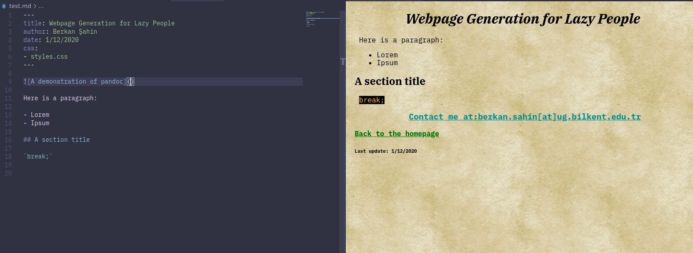

If you are someone like me, you quickly get bored of repetitive tasks and if they are related to computers you seek ways to automate them. Writing HTML by hand was fun for the first few times but it got boring as the amount of boilerplate per webpage started increasing. Thankfully, there are numerous utilities that makes lives of lazy people like me easier while not being insanely bloated. One such utility is [Pandoc](https://pandoc.org/).


## What is Pandoc?

Pandoc is a Haskell library and a command-line utility that converts various markup formats between each other. It is often used to convert markdown files to other formats like LaTeX, HTML, DOC etc. 

## Markdown?

You might have used markdown without even hearing its name. It is used widely to indicate formatting in sites/platforms such as [GitHub](https://docs.github.com/en/free-pro-team@latest/github/writing-on-github/about-writing-and-formatting-on-github), [Reddit](https://www.reddit.com/r/changelog/comments/mg1j6/reddit_change_new_markdown_interpreter/) and [Discord](https://support.discord.com/hc/en-us/articles/210298617-Markdown-Text-101-Chat-Formatting-Bold-Italic-Underline-) to name a few. 

Markdown was originally created to produce text that is easily readable by humans and formattable by machines. You can check out [this guide](https://guides.github.com/features/mastering-markdown/) by GitHub to learn the basics of Markdown.

## Installing Pandoc

Refer to the instructions [here](https://pandoc.org/installing.html) to install Pandoc for your platform (the rest of this guide assumes that you are running a distribution of GNU/Linux, but it should work with Windows and macOS with minor, if any, changes)

## Modifying the HTML Template

By default, pandoc only creates a "chunk" of HTML that you can add to an existing site. For standalone web pages, there is a standalone mode in which pandoc inserts the HTML equivalent of your Markdown text and various data (date, title, stylesheet names etc.) into a HTML template. You can specify a custom template file to have more control over your page's layout. 

You can modify the default template instead of writing one from scratch, since most people will need few deviations from the defaults. To do so, you first need to tell pandoc to put the default HTML template into a file by typing `pandoc -D html > template.html` into your terminal/command prompt. You can now open the file in your preferred text editor and modify it to your heart's content. 

Pandoc templates have an extensive syntax, but we don't need to understand all of it.

### What I customized

For my template, I modified three things:

1. ~~I removed the part that loads default HTML styling because I already have a stylesheet for my website.~~
    I actually restored this section as it enables syntax highlighting on code blocks. I still think that it needs to be mentioned. More on that later.

    ```html
      <style>
      $styles.html()$
      </style>
    ```
2. I removed the automatically generated paragraphs for all the information except the title, which is:

    ```html
    $if(subtitle)$
    <p class="subtitle">$subtitle$</p>
    $endif$
    $for(author)$
    <p class="author">$author$</p>
    $endfor$
    $if(date)$
    <p class="date">$date$</p>
    $endif$
    ```
I think this is the right time to discuss basic template syntax. In pandoc templates, blocks enclosed with dollar signs are either variables or statements. 
- If statements such as `$if(date)$` check for the existence of a variable and add the content below itself and above the `$endif$` statement if the variable exists.
- For statements like `$for(author)$` check for existence of the list inside the parenthesis, and they repeatedly add the content between the for and endfor statements for each member of the specified list.
- `$var$` is substituted with the variable var if it is inside an if statement. If it's inside a for statement, `$var$` is substituted with a member of the list named var for each iteration.

3. Lastly I added some common links and info at the end of the template before the closing body tag

    ```html
    <a href="/">Back to the homepage</a>
    <div class="bottom">
    <h3><a href="mailto:berkan.sahin@ug.bilkent.edu.tr">Contact me at:berkan.sahin[at]ug.bilkent.edu.tr</a></h3>
    <h5><a href="/about.html">About Me</a> | <a href="https://github.com/berkan-sahin/">GitHub: berkan-sahin</a></h5>
    $if(date)$
    <h6>Last update: $date$</h6>
    $endif$
    <h6>Generated with <a href="https://pandoc.org">Pandoc</a></h6>
    </div>
    ```

## Metadata blocks

One of the most important features of Pandoc is the metadata blocks. Metadata blocks contain information such as the page title, author(s), the date and the stylesheet(s) for the page. They are not rendered directly in the final page, but they influence its look and structure by setting variables that are then placed into the template accordingly.

Metadata blocks are usually at the top of the document and they *must* begin and end with three hyphens (`---`). They are written in a language called YAML.

### Some examples

- `title: Example` sets the title to Example. By default this adds a heading to the very top of the page and sets the page title (The text in your tab bar) to Example.
- ```yaml
    author:
    - Berkan Şahin
    - John Doe
   ```
   creates a list named author with the values Berkan Şahin and John Doe in it. Lists are usually evaluated by `$for$` statements and they are useful for adding a variable amount of items to your document such as multiple stylesheets or multiple authors.
- ```yaml
    abstract: |
        This is an abstract

        Lorem ipsum dolor sit amet.
    ```
    denotes a variable that spans multiple lines.

Here is the metadata block I used for this page at the time of writing this:

```yaml
---
title: Webpage Generation for Lazy People
author: Berkan Şahin
date: 02/12/2020
css: 
- /styles.css
---
```

## Generating the HTML Document

If you are satisfied with your markdown file, you can now call `pandoc` to generate the final HTML page. 

For this example, suppose that your markdown file is named `content.md`. We will also assume that your custom template is in the same directory as your markdown file and is named `template.html`. In this case, you tell pandoc to generate your webpage by typing
```bash
pandoc -s content.md --template=template.html -o content.html
```
### Explaining the flags

- The `-s` option in this command tells pandoc that this is a standalone webpage.
- `content.md` is the name of our markdown file
- `--template=template.html` tells pandoc to use our custom template named `template.html`
- The `-o content.html` tells pandoc to generate a HTML file named `content.html`

## Automating the build process with make

You probably noticed that this command is pretty long and you probably thought that typing this every time you want to generate a webpage is a tedious task and seems contradictory to our goals. In fact, you are right. But thankfully we can use tools such as `make`, which are designed to make the tedious process of building software easier while still being very flexible.

### What is make?

[The GNU project](https://gnu.org/) define make as `a tool which controls the generation of executables and other non-source files of a program from the program's source files`. Make is mostly used to build large programs given their source code, but we can employ a small fraction of make's capabilities to make the webpage generation process almost as easy as saying `make me a webpage`.

### Getting make

Make is a tool with a relatively long history and therefore has many different [implementations](https://en.wikipedia.org/wiki/Make_(software)#Derivatives). The one we are interested in is [GNU make](https://www.gnu.org/software/make/), as it has become the de-facto industry standard of make derivatives.

- If you are on GNU/Linux, you either already have make installed or you can easily install it the same way you install other software. 99.9% of the time GNU make is easily available in your distribution's package repositories and it is usually called make. For example on Debian, Ubuntu and their derivatives, you can type `sudo apt install make` in a terminal to get GNU make.
- On macOS, make is part of a bundle called XCode Developer Tools. Therefore the most straightforward way of installing make (among other potentially useful tools) is typing `xcode-select --install` on a terminal. *(Special thanks to [Berk Çakar](https://berkcakar.dev) for the instructions)*
- If you are on Windows, you can use the [Chocolatey](https://chocolatey.org/) package manager to install make and other tools. Once you have chocolatey [installed](https://chocolatey.org/install), simply type `choco install make` in a PowerShell terminal.

### Makefiles

Makefiles are simply the equivalent of recipes, but for programs instead of food. A makefile for a robot that makes a cake would be:

```Makefile
Apple Cake : Apples, flour, sugar, eggs etc.
    preheat oven
    mix flour and eggs
    ...
```
Using this example, we can examine the general form of a makefile:

- `Apple Cake` is the name of our output, which would be the HTML file in our case.
- `Apples, flour, sugar, eggs etc.` are the ingredients that are used to make the particular recipe. If an ingredient is missing, make looks for a recipe for the missing ingredient, if there is any. If no recipe is found, make fails. This behavior is especially useful when building large software that has complex dependency relationships.
- The following indented lines are the actual instructions that are executed by make while building the program. These are executed sequentially.

In our apple cake example, the specific type of apple that is used did not matter. The recipe wouldn't change if say, you used Granny Smith apples instead of Amasya apples. Make actually allows for flexibility like that, and we can utilize this behavior to write a generic makefile for *any pandoc-compliant markdown file*.

After some ingenuity and examination of [GNU Make Documentation](https://www.gnu.org/software/make/manual/html_node/Pattern-Rules.html#Pattern-Rules) we have this generic form, which you can download [here](Makefile).

```Makefile
%.html : %.md template.html
		pandoc -s $< --template=template.html -o $@
```

This recipe basically builds `x.html` from `x.md` using `template.html` as a template where x is any valid filename sans extension, provided that `x.md` exists.

Please keep in mind that your makefile must be named `Makefile` and it must be stored in the directory where `make` is run. Now you can type `make mypage.html` and your computer will automatically generate `mypage.html` from `mypage.md`, saving precious minutes which can be used in other activities (e.g sleeping). Magic, right?

## Further reading

- [The pandoc manual](https://pandoc.org/MANUAL.html)
- [GNU Make Documentation](https://www.gnu.org/software/make/manual/make.html)

**[06/05/2021]:** It's been 4 months and this tutorial is still not complete, I know. This method will probably be obsoleted by `panbash` in a month or so anyway. Maybe I'll adapt this tutorial to **that software** instead (It will be a lot easier and less janky than my Makefile solution). Stay tuned for that! 
